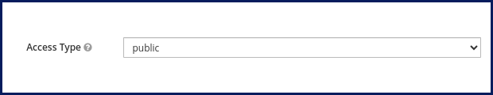

# galaxy-kc

`Galaxy-kc` is a web application for `Jitsi` admins and users to organize their
Jitsi meetings, meeting schedules and attendees.

This version uses `Keycloak` as the identity provider. Check
[Galaxy](https://github.com/emrahcom/galaxy) for version with a built-in
identity management system.

### Try it

Try `Galaxy` using publicly available implementation on
[https://eparto.net](https://eparto.net)

Also check out
[Eparto Virtual Phone](https://github.com/emrahcom/eparto-virtual-phone) if you
want to use your browser as a virtual phone and make calls directly, without
needing to open any websites.

### Features

- Use `Keycloak` as the identity management system
- Add as many Jitsi servers as you want
- Allow your partners to access your Jitsi server for different use-cases:
  - `domain partnership`: allow them to access the whole Jitsi server without
    sharing your secret key or the private key
  - `room partnership`: allow them to manage some Jitsi rooms
  - `meeting membership`: allow them to access some meetings as `moderator` or
    as `limited participant`
- Allow partnership using an invite link
- Allow membership using an invite link
- Create access links for unregistered users
- Create disposable or permanent access links
- Create scheduled meetings
- Calendar view for scheduled meetings
- Waiting room for scheduled meetings
- Direct call (_call other users just like a phone call_)
- Virtual phone (_receive calls from anyone, even those without an account_)
- Email notification for missed calls, upcoming meetings, etc.
- Manage your Jitsi profiles
- Ability to attach a profile to a specific meeting
- Unpredictable room name support. Create meeting links for anonymous Jitsi
  servers (such as `meet.jit.si`) and share these links with your members.
  Although the actual meeting link is updated periodically in the background
  (using some hashing algorithm), members can always join the meeting using its
  static `Galaxy` link. So, only your members can join this unprotected meeting
  room.
- Built-in JWT support
- Built-in [JaaS](https://jaas.8x8.vc) support
- Transfer all your Jitsi resources (rooms, meetings, partners, members, etc.)
  in one simple step to a new Jitsi server.

### Docker setup

Copy [env.sample](/env.sample) as `.env`, update parameters in it according to
your environment then start containers with `docker-compose`:

```bash
git clone https://github.com/emrahcom/galaxy-kc.git
cd galaxy-kc

cp env.sample .env

# Edit .env

docker compose pull
docker compose up -d
```

### Standalone setup

#### Prerequisites

- `Debian 12 Bookworm` server\
  _Use a dedicated server, not shared one... It will be heavily customized._
- At least 2 GB RAM and 6 GB disk space
- An `FQDN`. e.g. `app.galaxy.corp`
- A DNS `A record` for this `FQDN` pointing to the server
- Allow the following ports if the server is behind a firewall
  - `TCP/80` (_needed for Let's Encrypt certificate_)
  - `TCP/443`
- A `Keycloak` server

#### Installation

Run the following commands as `root`:

- Update `GALAXY_FQDN` according to your domain name.

- Update `KEYCLOAK_*` parameters according to your `Keycloak` configuration.

- Update `MAILER_*` parameters according to your email system.

  _See [NodeMailer reference](https://nodemailer.com/smtp/) for more details_

- If this is a test setup and you don't have resolvable FQDNs, please set
  `SKIP_DNS_CHECK` before installation.

  ```bash
  export SKIP_DNS_CHECK=true
  ```

- If this is a test setup and your `Keycloak` doesn't have a trusted
  certificate, please set `IGNORE_CERT_ERRORS` before installation.

  ```bash
  export IGNORE_CERT_ERRORS=true
  ```

```bash
wget https://raw.githubusercontent.com/emrahcom/bookworm-lxc-base/main/installer/eb
wget https://raw.githubusercontent.com/emrahcom/galaxy-kc/main/installer/eb-galaxy-kc.conf

export GALAXY_FQDN="app.galaxy.corp"
export KEYCLOAK_ORIGIN="https://ucs-sso-ng.mydomain.corp"
export KEYCLOAK_REALM="ucs"
export KEYCLOAK_CLIENT_ID="galaxy"
export MAILER_HOST="mail.galaxy.corp"
export MAILER_PORT=465
export MAILER_SECURE=true
export MAILER_USER="username"
export MAILER_PASS="password"
export MAILER_FROM="no-reply@galaxy.corp"

bash eb eb-galaxy-kc
```

#### Let's Encrypt certificate

Let's say the host address of the application is `app.galaxy.corp`. To set the
Let's Encrypt certificate:

```bash
set-letsencrypt-cert app.galaxy.corp
```

### Keycloak config

Create the client and users inside the realm`:

- Create the `realm` (_e.g. `ucs`_)
- Switch to the newly created realm
- Create the client in this realm.
  - Client type: `OpenID Connect`
  - Client ID: `galaxy`
  - Client authentication: `off`
  - Authorization: `off`
  - Authentication flow
    - `Standard flow`
    - `Direct access grants`
  - Add Galaxy URL into `Valid redirect URIs` (_e.g. `https:/app.galaxy.corp`_)
  - Valid post logout redirect URIs: `+`
  - Web origins: `+`
  - For Keycloak versions < 20.x, set Access type to `public`:

    

  - For Keycloak versions >= 20.x, disable `Client authentication`:

    
- Create the users inside this realm.
